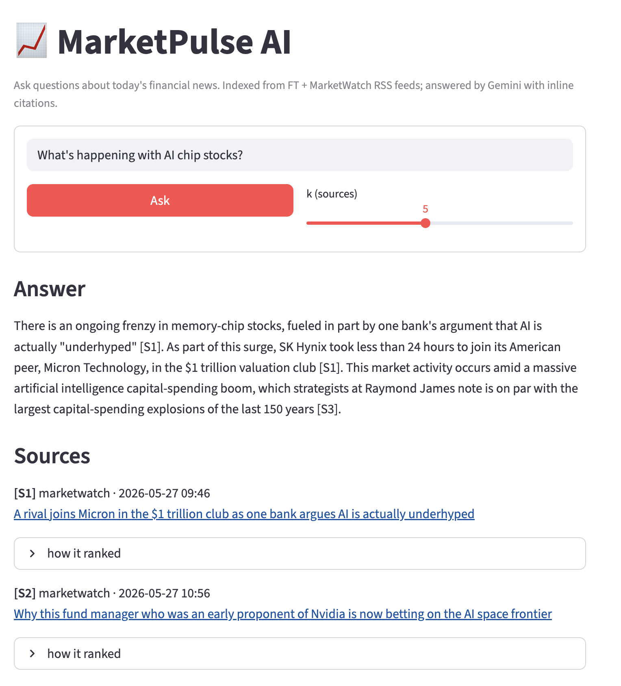

# 📈 MarketPulse AI

> Small, runnable RAG demo over financial news. Ingests RSS feeds, retrieves the
> top-k most relevant chunks (cosine similarity + recency decay), and asks Gemini
> to synthesize a cited answer.

**Status:** v0.1 MVP — feature-complete. See [`docs/MVP_SCOPE.md`](docs/MVP_SCOPE.md)
for what's in scope and what's deliberately deferred to v0.2+.



---

## What it does

```
USER:  "What did the financial press report about the Fed this week?"

  │ make ingest         RSS (FT + MarketWatch) → dedup → chunk
  │                     → BGE-small embed → ChromaDB upsert
  │
  │ retrieval.search()  cosine top-k + recency blend (0.7 / 0.3)
  │
  │ synthesis.answer()  build prompt with [S1]..[Sk] markers
  │                     → Gemini stream → cited answer
  │
  ▼ make ui             Streamlit at http://localhost:8501
                        (streamed answer + sources + score panels)
```

Two sources, one local vector store, one LLM call. No Kafka, no LangGraph, no
Langfuse — the v0.1 scope is deliberately minimal so the full pipeline fits in
~600 LOC and runs locally in seconds.

## Quickstart

```bash
# Prereqs: macOS/Linux, Python 3.12+, uv (https://docs.astral.sh/uv/), a Google
#          AI Studio API key (free tier — https://aistudio.google.com/apikey)

git clone <this-repo>
cd MarketPulseAI

# 1. Install deps (downloads PyTorch + sentence-transformers on first run; ~1 GB,
#                  cached forever after)
uv sync

# 2. Add your Gemini key
cp .env.example .env
# then edit .env and paste your key

# 3. Pull in some articles (~10 seconds, ~20 chunks from 2 RSS feeds)
make ingest

# 4. Ask a question via CLI
make ask Q="What is the financial press saying about AI chip stocks?"

# 5. Or launch the Streamlit UI
make ui   # → open http://localhost:8501
```

Other commands:

| Command | What it does |
|---|---|
| `make help` | Lists all Makefile targets |
| `make query Q="…"` | Retrieval-only (no LLM call, no cost) — useful for tuning |
| `make lint` / `make fmt` | ruff |
| `make typecheck` | mypy strict on `src/marketpulse/` |
| `make test` | pytest, 34 unit tests, ~1.3s |
| `make clean` | Wipe `.venv/` and tool caches |

## Project structure

```
src/marketpulse/
  ingestion/      # fetch + dedup + chunk + embed + upsert
  retrieval/      # search() with cosine + recency blend
  llm/            # LLMProvider Protocol + GeminiProvider
  synthesis/      # answer orchestration + prompt templates
  ui/             # Streamlit app
tests/            # 34 unit tests (no live network, no real LLM)
docs/             # MVP_SCOPE + (future) ARCHITECTURE, DECISIONS
data/             # ChromaDB lives here at runtime (gitignored)
```

## Tech stack

`uv` · `ruff` · `mypy --strict` · `pytest` · `feedparser` · `sentence-transformers`
(BGE-small-en-v1.5, local) · `chromadb` (PersistentClient) · `google-genai`
(Gemini `gemini-flash-latest`) · `streamlit` · `python-dotenv`.

## Design highlights

- **Provider abstraction** (`src/marketpulse/llm/provider.py`) — `LLMProvider` is
  a `typing.Protocol` with a single `generate_stream` method. Swapping Gemini
  for Groq, OpenAI, or local Ollama is one new file implementing the Protocol.
- **Idempotent ingestion** — chunks are keyed by `sha256(url)_chunk_idx`, so
  re-running `make ingest` upserts (zero duplicates) instead of accumulating.
- **Cosine + normalized embeddings** — Chroma's default L2 is wrong for BGE;
  collection is created with `hnsw:space=cosine` and embeddings are L2-normalized
  at both index and query time.
- **Refusal via prompt, not code** — the synthesis prompt instructs Gemini to
  explicitly say so when sources don't answer the question, rather than letting
  it fabricate. Verified on out-of-corpus queries (e.g. *"airspeed velocity of
  an unladen swallow"* → graceful refusal, no fake citations).

## Deferred to future versions

See [`docs/MVP_SCOPE.md`](docs/MVP_SCOPE.md) for the full deferral table.
Headline items: **v0.2** — Kafka, more sources (SEC EDGAR, Reddit, etc.),
source-credibility weighting, MMR re-ranking. **v0.3** — LangGraph multi-agent
(Router + Critique + Grader), Langfuse observability, RAGAS evaluation.
**v0.4** — FastAPI + WebSockets + auth, Docker Compose, deployment.
